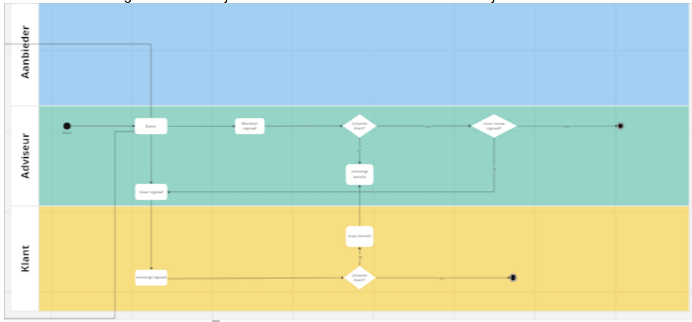

# Voorbeelden

## Use case 1: servicegerelateerde gebeurtenis

In deze use case initieert de aanbieder (bijv. verzekeraar, adviseur) de servicegerelateerde gebeurtenis. Bijvoorbeeld een verzekeraar die, in verband met naderende premie-afschrijving, de consument mailt met het verzoek om de betaalgegevens te controleren.

In onderstaande afbeelding vind je een voorbeeld hiervan: aanbieder Allianz stuurt naar aanleiding van een aanstaande premie-afschrijving de consument een e-mail, met oproep tot het controleren van diens betaalgegevens. De aanstaande premie-afschrijving is hierin de (servicegerelateerde) gebeurtenis, en het controleren van de betaalgegevens de actie.

Bovenstaand voorbeeld kan als volgt in de SIVI AFS signalStructure worden gecommuniceerd of vastgelegd:

<aside class="example" title="SIVI AFS signalStructure (in JSON)">
	<pre>
		<code>
{
"signal": [{
	"entityType": "serviceEvent",
	"partyRef": ["bwsflk189"],
	"policyRef": ["DFNUI29324176S"],
	"serviceEventType": "09",
	"eventDescription": "Aankondiging premie-afschrijving",
	"companyNameDescription": "Allianz",
	"action": [{
		"entityType": "default",
		"actionType": "19",
		"actionDescription": "Rekening controleren",
		"priority": 1,
		"actionExplanation": "Zorg ervoor dat je voldoende saldo op je rekening hebt en dat we de juiste betaalgegevens hebben",
		"url": "http://mijnaccount.allianz.nl"
	}],
	"document": [{
		"entityType": "default",
		"messageSubject": "Onderwerp van de e-mail",
		"toAddress": "j.janssen@...",
		"replyAddress": "support@allianz.nl"
	}]
}]}
		</code>
	</pre>
</aside>

## Use case 2: levensgebeurtenis, initiatief bij aanbieder

Ook in deze use case initieert de aanbieder (bijv. verzekeraar, adviseur) het signaal, maar dit keer vanuit een levensgebeurtenis. Bijvoorbeeld wanneer een consument 18 jaar wordt.

In dit voorbeeld gaat het dus om een lifeEvent waarbij de consument 18 jaar is geworden. Als bijbehorende acties hebben we hiervoor gemodelleerd dat de consument een DigiD moet aanvragen, een zorgverzekering moet afsluiten en een taart moet kopen. Die laatste actie is een voorbeeld van een niet-gestandaardiseerde actie en staat dus niet in de codelijst AFDACT.

<aside class="example" title="SIVI AFS signalStructure (in JSON)">
	<pre>
		<code>
{
"signal": [{
	"entityType": "lifeEvent", 
	"partyRef": ["alexappelhof21"],
	"lifeEventType": "10",
	"eventDescription": "18 jaar worden",
	"action": [{
		"entityType": "default",
		"actionType": "01",
		"actionDescription": "DigiD aanvragen",
		"priority": 1,
		"actionExplanation": "Als je 18 jaar wordt heb je een DigiD nodig",
		"url": "http://digid.nl"
	},
	{
		"entityType": "default",
		"actionType": "02",
		"actionDescription": "Zorgverzekering afsluiten",
		"priority": 1,
		"actionExplanation": "Als je 18 jaar wordt heb je een eigen zorgverzekering nodig",
		"url": "http://independer.nl"
	},
	{
		"entityType": "default",
		"actionType": "99",
		"actionDescription": "Taart kopen",
		"priority": 2
	}]
}]}
		</code>
	</pre>
</aside>

## Use case 3: levensgebeurtenis, initiatief bij consument

Als laatste use case opnieuw een signaalbericht naar aanleiding van een levensgebeurtenis, maar nu met het initiatief bij de consument. In dit voorbeeld een consument die gaat verhuizen en doorgeeft aan de aanbieder dat hij/zij gaat verhuizen.

Ook dit is te modelleren met de SIVI AFS signalStructure, waarmee de consument aan de aanbieder aangeeft dat deze het proces moet starten dat hoort bij een adreswijziging. (NB: De adreswijziging zelf komt dus in een later stadium, het gaat hier puur om het signaal.)

<aside class="example" title="SIVI AFS signalStructure (in JSON)">
	<pre>
		<code>
{
"signal": [{
	"entityType": "lifeEvent",
	"partyRef": ["olagemaat23z5"],
	"lifeEventType": "14",
	"eventDescription": "Verhuizing",
	"action": [{
		"entityType": "default",
		"actionType": "20",
		"actionDescription": "Adres wijzigen",
		"priority": 1,
		"actionExplanation": "Adres van klant wijzigen" 
	}]
}]}
		</code>
	</pre>
</aside>
